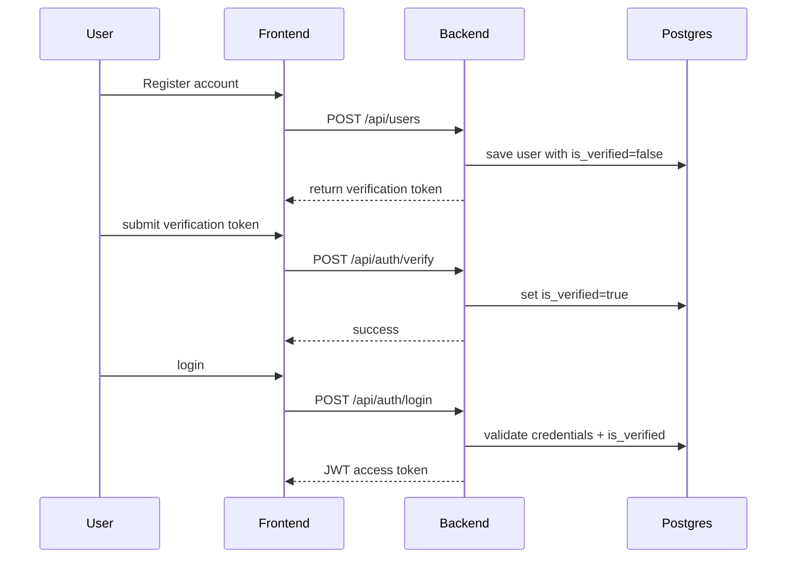

# Blog Platform

A full-stack blog platform with React + Vite frontend, FastAPI backend, PostgreSQL persistence, Redis support, and NGINX reverse proxy.

## Architecture Overview

This repository includes a multi-service blog platform split into:

- `frontend/` — React + TypeScript + Vite UI
- `backend/` — FastAPI REST API, SQLAlchemy ORM, Alembic migrations
- `postgres` — PostgreSQL 16 database
- `redis` — Redis cache/session store
- `nginx` — reverse proxy serving the frontend and proxying API requests

### Architecture diagram

```mermaid
flowchart LR
    A[Browser] -->|HTTP 8080| B[NGINX]
    B -->|/api/*| C[Backend (FastAPI)]
    B -->|/*| D[Frontend (React)]
    C -->|PostgreSQL SQL| E[Postgres]
    C -->|Redis cache| F[Redis]
    C -->|Uploads| G[Uploads Volume]
    E -->|Persistent storage| H[postgres_data volume]
    G -->|Persistent storage| I[uploads_data volume]
```

## Key Features

- User registration and login
- Email verification gating before login
- JWT authentication
- Post creation, retrieval, and tagging
- File uploads served through backend static route
- Fully containerized with Docker Compose

## Project Structure

```text
.
├── backend/
│   ├── app/
│   │   ├── api/
│   │   ├── core/
│   │   ├── db/
│   │   ├── models/
│   │   ├── repositories/
│   │   ├── schemas/
│   │   ├── services/
│   │   └── main.py
│   ├── alembic/
│   ├── requirements.txt
│   └── Dockerfile
├── frontend/
│   ├── src/
│   ├── package.json
│   ├── tsconfig.json
│   └── Dockerfile
├── docker-compose.yml
├── docker/nginx/nginx.conf
└── README.md
```

## Local Development

### Prerequisites

- Docker Desktop or Docker Engine
- Docker Compose
- Node.js and npm (only if you want to run frontend outside Docker)

### Start the stack

1. Copy environment files

```powershell
copy .env.example .env
copy backend\.env.example backend\.env
copy frontend\.env.example frontend\.env
```

2. Configure required values in `backend/.env`:

- `SECRET_KEY` — a random secret for JWT signing
- `POSTGRES_DB`, `POSTGRES_USER`, `POSTGRES_PASSWORD`
- `ACCESS_TOKEN_EXPIRE_MINUTES`
- `ALGORITHM` (default: `HS256`)
- `REDIS_URL` (default: `redis://redis:6379/0`)

3. Launch services

```powershell
docker compose up -d --build
```

4. Verify the stack

- Frontend: `http://localhost:8080`
- Backend health: `http://localhost:8000/health`

### Stop the stack

```powershell
docker compose down
```

### Reset persisted data

```powershell
docker compose down -v
```

## Backend Details

- `backend/Dockerfile` builds a Python 3.12 image with dependencies installed into a virtual environment.
- `backend/app/main.py` exposes API routers and serves uploaded files from `/uploads`.
- Alembic runs at container startup via `alembic upgrade head`.

### Backend endpoints

- `POST /api/auth/login` — authenticate user and return JWT
- `POST /api/auth/verify` — verify email with token
- `GET /api/auth/me` — fetch current authenticated user
- `POST /api/users` — register new user

> Note: The backend login logic now denies access until `is_verified` is true.

## Frontend Details

- Built with React, Vite, Tailwind CSS, React Router, and React Query.
- `frontend/Dockerfile` builds the production bundle and serves it with NGINX.
- The frontend configures API requests via `VITE_API_URL=/api`.

### Run frontend locally

```powershell
cd frontend
npm install
npm run dev
```

## Database

- PostgreSQL data is persisted in Docker volume `postgres_data`.
- Upload files are persisted in Docker volume `uploads_data`.

### Add Alembic migration

If DB schema changes are needed:

```powershell
cd backend
alembic revision --autogenerate -m "describe change"
alembic upgrade head
```

## Email Verification Flow



## Environment Variables

### Top-level `.env` / `backend/.env`

- `APP_NAME` — application friendly name
- `DEBUG` — development mode flag
- `DATABASE_URL` — connection string for PostgreSQL
- `SECRET_KEY` — JWT signing secret
- `ALGORITHM` — JWT algorithm
- `ACCESS_TOKEN_EXPIRE_MINUTES` — token TTL
- `REDIS_URL` — Redis connection string

### Frontend `.env.example`

- `VITE_API_URL` — API base path used by the frontend

## Deployment Notes

- NGINX listens on port `8080` and proxies `/api` to backend.
- Backend listens on port `8000` internally.
- Static uploads are served from `/uploads/` through NGINX.

## Troubleshooting

- `docker compose logs backend` — view backend startup logs
- `docker compose logs postgres` — inspect DB readiness
- `docker compose ps` — service status

## Useful Commands

```powershell
docker compose up -d --build
docker compose logs --follow backend
docker compose down -v
```

## Notes

- This README is the canonical entrypoint for developers working on the full stack.
- For frontend or backend-specific docs, see `frontend/README.md` or add a `backend/README.md` if needed.
